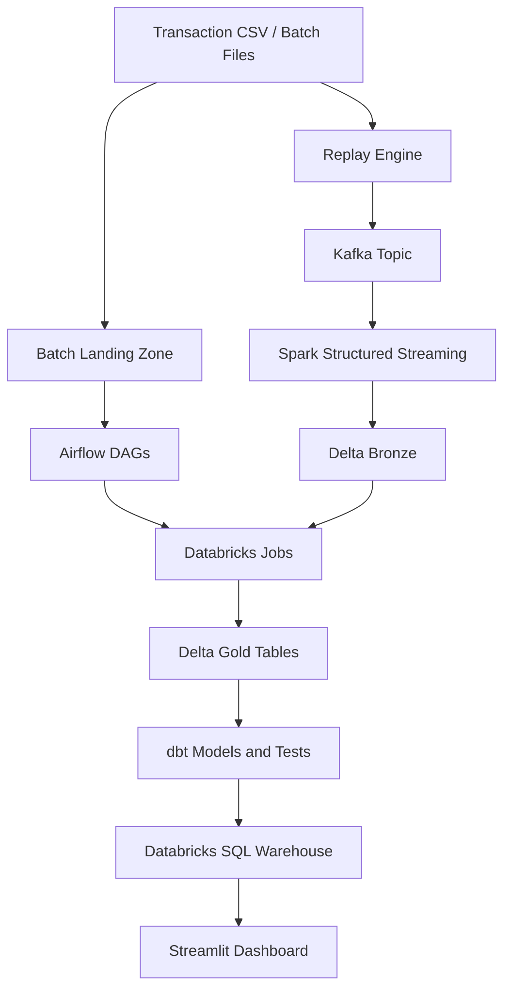

# Architecture

This platform follows a lakehouse-oriented fraud analytics architecture.

## Layers

- **Ingestion:** Replay and batch utilities load raw transaction data.
- **Streaming:** Kafka and Spark Structured Streaming simulate real-time payment flows.
- **Lakehouse:** Delta Lake stores bronze and curated analytical tables.
- **Transformation:** Databricks and dbt create business-ready fraud metrics.
- **Orchestration:** Airflow coordinates batch and Databricks workflows.
- **Serving:** Streamlit reads Databricks SQL Warehouse outputs.

## Security Model

No secrets are hardcoded. Runtime credentials must be supplied through environment variables, Airflow connections, Databricks workspace configuration, or Streamlit Community Cloud secrets.
