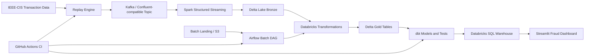

# Enterprise Real-Time Fraud Detection & Payment Intelligence Platform

Production-style data engineering platform for detecting fraudulent payment activity across streaming and batch workloads. The project demonstrates event replay, Kafka ingestion, Spark/Delta processing, Airflow orchestration, Databricks jobs, dbt gold-layer modeling, and a Streamlit analytics dashboard.

> This repository is designed as an open-source portfolio project. It uses safe placeholders for credentials and does not require production cloud secrets for CI validation.

## Business Problem

Payment platforms need to identify suspicious transactions quickly while keeping trusted customer activity flowing. This project models an enterprise fraud analytics architecture that can:

- Replay transaction events into Kafka for streaming simulation.
- Process raw events into bronze/silver/gold analytical layers.
- Support batch enrichment and scheduled orchestration.
- Publish curated fraud metrics for operations and executive reporting.
- Present payment intelligence through a Streamlit dashboard backed by Databricks SQL.

## Architecture



## Technology Stack

- **Python 3.12** for ingestion utilities, replay logic, tests, and dashboard code.
- **Kafka / Confluent-compatible APIs** for event streaming.
- **Spark Structured Streaming** for real-time ingestion.
- **Delta Lake** for lakehouse storage patterns.
- **Databricks** for managed transformation and SQL serving.
- **Airflow** for orchestration.
- **dbt** for curated gold-layer SQL models and quality checks.
- **Streamlit** for deployment-ready analytics.
- **Docker Compose** for local service build validation.
- **GitHub Actions** for CI quality gates.

## Architecture Components

### Streaming Pipeline

The replay engine reads transaction CSV records and publishes JSON events to Kafka. Spark consumes the Kafka topic, parses transaction payloads, and writes bronze Delta output with checkpointing for fault tolerance.

### Batch Pipeline

Batch scripts support landing-file validation and S3-oriented workflows. The Airflow batch DAG coordinates file upload, validation, Databricks workflow execution, dbt build, snapshots, and documentation generation. Runtime credentials are always supplied through environment variables or Airflow connections.

### Airflow

Airflow DAGs live in `airflow/dags/`. They are import-tested in CI without starting the scheduler or webserver. Databricks job IDs are read from environment variables:

- `DATABRICKS_BATCH_JOB_ID`
- `DATABRICKS_STREAMING_JOB_ID`

### Kafka

The root `docker-compose.yml` provides a local Kafka broker and Kafka UI for development. Confluent Cloud credentials are never hardcoded; use `KAFKA_BOOTSTRAP_SERVERS`, `KAFKA_API_KEY`, and `KAFKA_API_SECRET`.

### Databricks and Delta Lake

Databricks notebooks under `databricks/notebooks/` document transformation stages. Delta paths, Databricks tokens, warehouse hostnames, and job IDs must be configured externally.

### dbt

The dbt project is in `fraud_gold/`. It defines staging, gold summary models, tests, macros, and snapshots for fraud analytics. CI validates `dbt deps`, `dbt parse`, and `dbt compile` only. It does not execute `dbt run`.

### Streamlit Dashboard

The Streamlit dashboard lives in `streamlit_dashboard/` and reads Databricks SQL Warehouse settings from environment variables or Streamlit Community Cloud secrets. Missing credentials produce a clear in-app error without exposing secret values.

## Project Structure

```text
.
├── .github/workflows/        # CI validation
├── airflow/                  # Airflow Docker image, compose file, DAGs
├── batch/                    # Batch landing, S3 upload, and validation scripts
├── configs/                  # Local runtime configuration
├── databricks/               # Notebooks and workflow assets
├── docs/                     # Project state and implementation notes
├── fraud_gold/               # dbt project for gold-layer marts
├── scripts/                  # Local setup helpers
├── src/                      # Streaming, replay, and shared utilities
├── streamlit_dashboard/      # Streamlit analytics app
├── tests/                    # Pytest suite
├── docker-compose.yml        # Local Kafka services
├── requirements.txt          # Python dependencies
└── requirements-dev.txt      # Development dependencies
```

## Setup

```bash
python -m venv .venv
source .venv/bin/activate
python -m pip install --upgrade pip
pip install -r requirements.txt
pip install -r requirements-dev.txt
```

On Windows PowerShell:

```powershell
python -m venv .venv
.\.venv\Scripts\Activate.ps1
python -m pip install --upgrade pip
pip install -r requirements.txt
pip install -r requirements-dev.txt
```

Copy the environment template for local development:

```bash
cp .env.example .env
```

Never commit `.env`.

## Environment Variables

Core variables:

- `KAFKA_BOOTSTRAP_SERVERS`
- `KAFKA_TOPIC`
- `KAFKA_API_KEY`
- `KAFKA_API_SECRET`
- `DATABRICKS_SERVER_HOSTNAME`
- `DATABRICKS_HTTP_PATH`
- `DATABRICKS_ACCESS_TOKEN`
- `DATABRICKS_CATALOG`
- `DATABRICKS_SCHEMA`
- `DATABRICKS_BATCH_JOB_ID`
- `DATABRICKS_STREAMING_JOB_ID`
- `AWS_ACCESS_KEY_ID`
- `AWS_SECRET_ACCESS_KEY`
- `AWS_DEFAULT_REGION`
- `S3_BUCKET`

Use `.env.example` for local placeholders and `streamlit_dashboard/.streamlit/secrets.toml.example` for Streamlit Community Cloud secrets.

## Running the Replay Engine

```bash
python -m src.replay_engine.replay
```

The replay engine expects Kafka configuration in the environment.

## Running Kafka Locally

```bash
docker compose up -d kafka kafka-ui
```

Kafka UI is exposed at `http://localhost:8080`.

## Running Airflow

```bash
cd airflow
docker compose up airflow-init
docker compose up airflow-webserver airflow-scheduler
```

Provide Airflow admin settings and Databricks job IDs through `.env` or shell environment variables.

## Running dbt

```bash
cd fraud_gold
dbt deps
dbt parse
dbt compile
dbt test
```

Use a local or Databricks dbt profile outside the repository.

## Running Streamlit

```bash
cd streamlit_dashboard
streamlit run app.py
```

For Streamlit Community Cloud, set Databricks credentials in app secrets using `streamlit_dashboard/.streamlit/secrets.toml.example` as the template.

## GitHub Actions CI

The workflow in `.github/workflows/ci.yml` runs on push and pull request. It:

- Installs Python 3.12 dependencies.
- Checks formatting with Black.
- Lints with Flake8.
- Runs pytest and allows repositories with no collected tests.
- Validates dbt dependencies, parsing, and compilation using a credential-free local profile.
- Imports Airflow DAG files without starting Airflow.
- Builds Docker images with `docker compose build`.

CI intentionally does not require Databricks, Confluent Cloud, AWS, Spark cluster, or Airflow runtime credentials.

## Screenshots

Add screenshots before publishing a polished release:

- `docs/images/dashboard-overview.png`
- `docs/images/fraud-trend.png`
- `docs/images/airflow-dags.png`
- `docs/images/dbt-lineage.png`

## Future Improvements

- Add Great Expectations or Soda checks for landing-zone validation.
- Add OpenLineage metadata collection for Airflow and dbt.
- Add IaC examples for Databricks jobs and cloud networking.
- Add sample masked dashboard screenshots.
- Add synthetic transaction generator for fully public demo data.

## Learning Outcomes

This project demonstrates enterprise data engineering practices across streaming ingestion, batch orchestration, lakehouse modeling, CI validation, dashboard deployment, and secure configuration management.

## License

This project is licensed under the MIT License - see the [LICENSE](LICENSE) file for details.

## Acknowledgements

This project is inspired by real-world fraud analytics architectures and public transaction fraud detection datasets such as IEEE-CIS.
