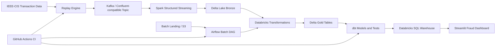

<div align="center">

# 🛡️ Enterprise Real-Time Fraud Detection & Payment Intelligence Platform

**Streaming + Batch data engineering platform for detecting fraudulent payment activity at scale**

[](https://github.com/Sudheendra66/Enterprise-Real-Time-Fraud-Detection-Payment-Intelligence-Platform/actions/workflows/ci.yml)


[](LICENSE)

*A production-style architecture demonstrating event replay, Kafka ingestion, Spark/Delta processing, Airflow orchestration, Databricks jobs, dbt gold-layer modeling, and Streamlit analytics.*

</div>

> 📦 **Open-source portfolio project** — uses safe placeholders for credentials and requires no production cloud secrets for CI validation.

---

## 📋 Table of Contents

- [Business Problem](#-business-problem)
- [Architecture](#-architecture)
- [Technology Stack](#-technology-stack)
- [Architecture Components](#-architecture-components)
- [Project Structure](#-project-structure)
- [Setup](#-setup)
- [Environment Variables](#-environment-variables)
- [Running the Platform](#-running-the-platform)
- [CI/CD](#-github-actions-ci)
- [Live Dashboard](#-live-dashboard)
- [Future Improvements](#-future-improvements)
- [Learning Outcomes](#-learning-outcomes)

---

## 💡 Business Problem

Payment platforms need to identify suspicious transactions quickly while keeping trusted customer activity flowing smoothly. This project models an enterprise fraud analytics architecture that:

| Capability | Description |
|---|---|
| 🔁 **Event Replay** | Replays transaction events into Kafka to simulate real-world streaming |
| 🥉🥈🥇 **Medallion Processing** | Processes raw events into bronze/silver/gold analytical layers |
| ⏱️ **Batch Enrichment** | Supports scheduled orchestration and reference data enrichment |
| 📊 **Fraud Metrics** | Publishes curated metrics for operations and executive reporting |
| 📈 **Live Dashboard** | Presents payment intelligence via Streamlit, backed by Databricks SQL |

---

## 🏗️ Architecture



---

## 🧰 Technology Stack

<div align="center">

| Layer | Tools |
|---|---|
| **Language** | Python 3.12 |
| **Streaming** | Kafka / Confluent-compatible APIs, Spark Structured Streaming |
| **Storage** | Delta Lake (lakehouse pattern) |
| **Compute** | Databricks (managed transformation + SQL serving) |
| **Orchestration** | Apache Airflow |
| **Transformation** | dbt (gold-layer SQL models + quality checks) |
| **Visualization** | Streamlit |
| **Local Dev** | Docker Compose |
| **CI/CD** | GitHub Actions |

</div>

---

## 🔩 Architecture Components

### 🌊 Streaming Pipeline
The replay engine reads transaction CSV records and publishes JSON events to Kafka. Spark consumes the Kafka topic, parses transaction payloads, and writes bronze Delta output with checkpointing for fault tolerance.

### 📦 Batch Pipeline
Batch scripts support landing-file validation and S3-oriented workflows. The Airflow batch DAG coordinates file upload, validation, Databricks workflow execution, dbt build, snapshots, and documentation generation. Runtime credentials are always supplied through environment variables or Airflow connections.

### 🌀 Airflow
DAGs live in `airflow/dags/` and are import-tested in CI without starting the scheduler or webserver. Databricks job IDs are read from environment variables:
- `DATABRICKS_BATCH_JOB_ID`
- `DATABRICKS_STREAMING_JOB_ID`

### 📨 Kafka
The root `docker-compose.yml` provides a local Kafka broker and Kafka UI for development. Confluent Cloud credentials are never hardcoded — configure via `KAFKA_BOOTSTRAP_SERVERS`, `KAFKA_API_KEY`, and `KAFKA_API_SECRET`.

### 🧱 Databricks & Delta Lake
Notebooks under `databricks/notebooks/` document each transformation stage. Delta paths, tokens, warehouse hostnames, and job IDs are all configured externally.

### 🛠️ dbt
The dbt project lives in `fraud_gold/`, defining staging models, gold summary models, tests, macros, and snapshots. CI validates `dbt deps`, `dbt parse`, and `dbt compile` only — it does **not** execute `dbt run`.

### 📺 Streamlit Dashboard
Located in `streamlit_dashboard/`, the app reads Databricks SQL Warehouse settings from environment variables or Streamlit Community Cloud secrets. Missing credentials produce a clear in-app error without ever exposing secret values.

---

## 📁 Project Structure

```text
.
├── .github/workflows/        # CI validation
├── airflow/                  # Airflow Docker image, compose file, DAGs
├── batch/                    # Batch landing, S3 upload, and validation scripts
├── configs/                  # Local runtime configuration
├── databricks/               # Notebooks and workflow assets
├── docs/                     # Project state and implementation notes
├── fraud_gold/               # dbt project for gold-layer marts
├── scripts/                  # Local setup helpers
├── src/                      # Streaming, replay, and shared utilities
├── streamlit_dashboard/      # Streamlit analytics app
├── tests/                    # Pytest suite
├── docker-compose.yml        # Local Kafka services
├── requirements.txt          # Python dependencies
└── requirements-dev.txt      # Development dependencies
```

---

## ⚙️ Setup

**macOS / Linux**
```bash
python -m venv .venv
source .venv/bin/activate
python -m pip install --upgrade pip
pip install -r requirements.txt
pip install -r requirements-dev.txt
```

**Windows (PowerShell)**
```powershell
python -m venv .venv
.\.venv\Scripts\Activate.ps1
python -m pip install --upgrade pip
pip install -r requirements.txt
pip install -r requirements-dev.txt
```

Copy the environment template for local development:
```bash
cp .env.example .env
```
> ⚠️ Never commit `.env`.

---

## 🔑 Environment Variables

<details>
<summary><strong>Click to expand full variable list</strong></summary>

| Variable | Purpose |
|---|---|
| `KAFKA_BOOTSTRAP_SERVERS` | Kafka broker endpoint |
| `KAFKA_TOPIC` | Target topic for transaction events |
| `KAFKA_API_KEY` | Confluent Cloud API key |
| `KAFKA_API_SECRET` | Confluent Cloud API secret |
| `DATABRICKS_SERVER_HOSTNAME` | Databricks workspace hostname |
| `DATABRICKS_HTTP_PATH` | SQL Warehouse HTTP path |
| `DATABRICKS_ACCESS_TOKEN` | Databricks personal access token |
| `DATABRICKS_CATALOG` | Unity Catalog name |
| `DATABRICKS_SCHEMA` | Target schema |
| `DATABRICKS_BATCH_JOB_ID` | Batch workflow job ID |
| `DATABRICKS_STREAMING_JOB_ID` | Streaming workflow job ID |
| `AWS_ACCESS_KEY_ID` | AWS access key |
| `AWS_SECRET_ACCESS_KEY` | AWS secret key |
| `AWS_DEFAULT_REGION` | AWS region |
| `S3_BUCKET` | Landing bucket for batch files |

</details>

Use `.env.example` for local placeholders and `streamlit_dashboard/.streamlit/secrets.toml.example` for Streamlit Community Cloud secrets.

---

## 🚀 Running the Platform

**Replay Engine**
```bash
python -m src.replay_engine.replay
```

**Kafka (local)**
```bash
docker compose up -d kafka kafka-ui
# Kafka UI → http://localhost:8080
```

**Airflow**
```bash
cd airflow
docker compose up airflow-init
docker compose up airflow-webserver airflow-scheduler
```

**dbt**
```bash
cd fraud_gold
dbt deps
dbt parse
dbt compile
dbt test
```

**Streamlit Dashboard**
```bash
cd streamlit_dashboard
streamlit run app.py
```
> For Streamlit Community Cloud, set Databricks credentials in app secrets using `streamlit_dashboard/.streamlit/secrets.toml.example` as the template.

---

## ✅ GitHub Actions CI

The workflow in `.github/workflows/ci.yml` runs on every push and pull request:

- ✔️ Installs Python 3.12 dependencies
- ✔️ Checks formatting with **Black**
- ✔️ Lints with **Flake8**
- ✔️ Runs **pytest** (tolerant of zero collected tests)
- ✔️ Validates dbt dependencies, parsing, and compilation via a credential-free local profile
- ✔️ Imports Airflow DAG files without starting Airflow
- ✔️ Builds Docker images with `docker compose build`

> 🔒 CI intentionally requires **no** Databricks, Confluent Cloud, AWS, Spark cluster, or Airflow runtime credentials.

---

## 🌐 Live Dashboard

The Streamlit fraud intelligence dashboard is deployed and publicly viewable:

**👉 [enterprise-real-time-fraud-detection-payment-intelligence-plat.streamlit.app](https://enterprise-real-time-fraud-detection-payment-intelligence-plat.streamlit.app/)**

---

## 🔮 Future Improvements

- [ ] Add Great Expectations or Soda checks for landing-zone validation
- [ ] Add OpenLineage metadata collection for Airflow and dbt
- [ ] Add IaC examples for Databricks jobs and cloud networking

---

## 🎓 Learning Outcomes

This project demonstrates enterprise data engineering practices across:

**Streaming ingestion** • **Batch orchestration** • **Lakehouse modeling** • **CI validation** • **Dashboard deployment** • **Secure configuration management**

---

## 📄 License

This project is licensed under the **MIT License** — see the [LICENSE](LICENSE) file for details.

## 🙏 Acknowledgements

Inspired by real-world fraud analytics architectures and public transaction fraud detection datasets such as **IEEE-CIS**.

---

<div align="center">

Built with ☕ and a lot of Spark jobs

</div>
